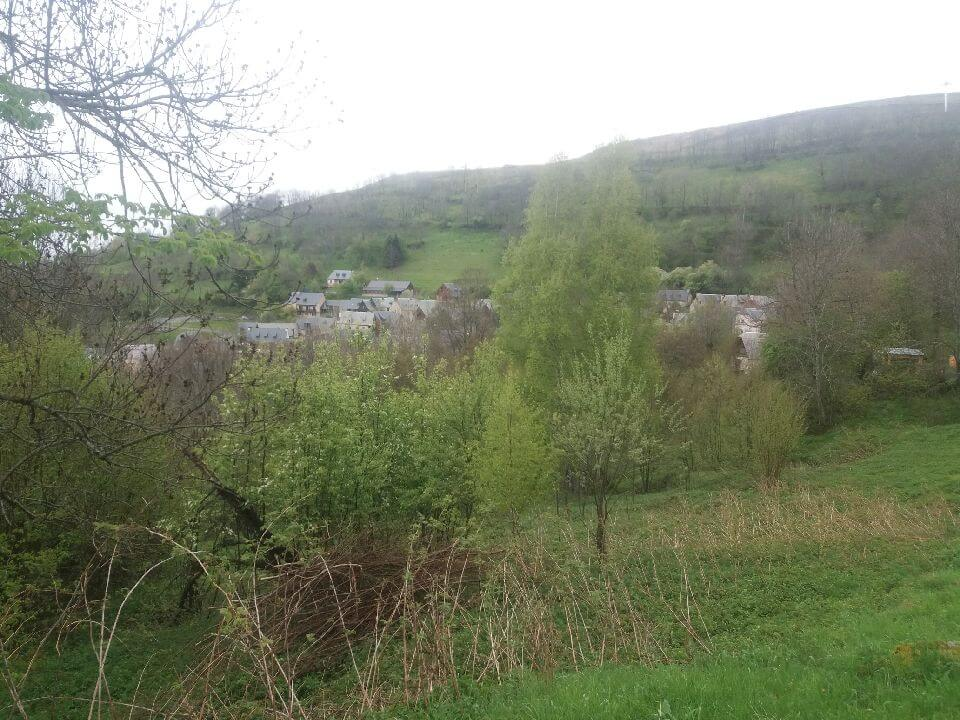
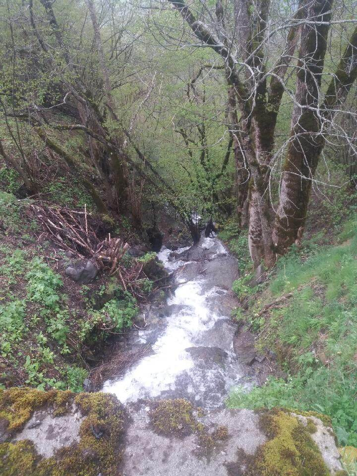
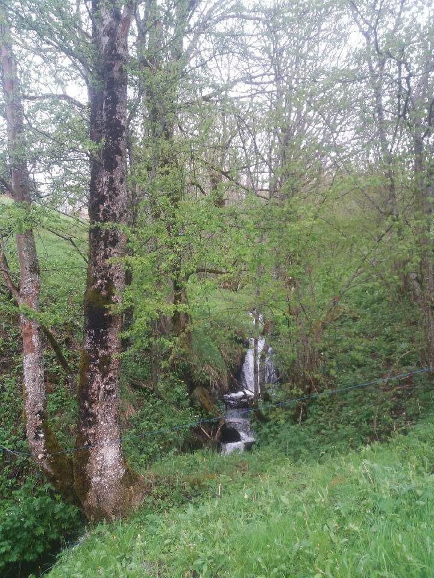

## Mauvais temps

Ce matin, j'ai eu le droit à un bon déluge. Au programme pluie et neige. J'ai discuté avec les locaux qui m'ont conseillé et convaincu d'attendre. J'avais prévu de faire une pause samedi donc j'ai anticipé l'arrêt.

## Pendant la journée

Je fais quand même une petite marche d'une heure autour de Germ.

J'ai rencontré un berger qui m'a donné de précieux conseils pour me guider si le temps était bouché avec de la neige.

Affaire à suivre donc. Demain est un autre jour.
