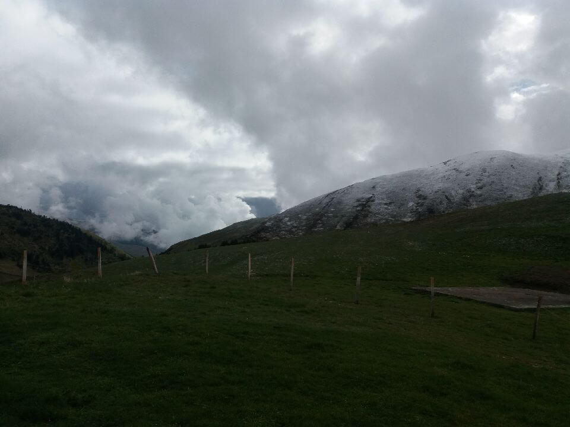

## Au revoir Germ

Ce matin, le temps est un peu moins couvert. Ces quelques éclaircies me permettent de me lancer pour une nouvelle avancée.

J'hésite à suivre le GR10 mais le col du Couret d'Esquierry à _2131m d'altitude_ est sous la neige et est bouché. J'ai demandé aux locaux ce qu'ils en pensaient et ils m'ont répondu que la fenêtre d'éclairci sera très courte mais peut-être suffisante pour passer le col. Je choisi de rester à 1800m et de tirer à vue car je reste sous les nuages et je peux en profiter bien plus et **j'ai bien fait** car 1h après tout est bouché à 1900m d'altitude environ

## Peragudes

Je passe par la station de Péragudes (_1700m d'altitude_), c'est complétement désert, on se croirait dans une vielle ville abandonnée d'un vieux western. Je monte en altitude jusqu'à la limite des nuages et je trace en ligne droite pour descendre à Bagnères-deLuchon. Le temps est plutôt maussade mais pas de pluie.

Deux biches me suivent :o Suprenant n'est-ce pas ? Je me demande tout de même est-ce mon odeur ou ma beau fatale ? ;) À vous de choisir !

## La route

À 4km de Bagnères-de-Luchon, je suis obligé de marcher sur le bitume... Et c'est le moment ou il se met à pleuvoir assez fortement... Cette forte pluie m'accompagnera jusqu'à Bagnères-de-Luchon. Heureusement que je suis bien équipé !!! À priori aujourd'hui 16 km environ.

Dommage que le temps n'était pas au rendez-vous, car sur le GR10 nous passons par le lac d'Oo qui semble-t-il est magnifique..

## Bagnères-de-Luchon

Arrivée à Bagnères-de-Luchon, je me trouve un camping pour y passer la nuit. Mes jambes sont lourdes mais bonne nouvelle je ne sens plus mon sac à dos sur les épaules.

## Pour demain

Les prévisions pour demain ne sont pas plus encourageante... Cette ville met fin au **Pyrénées centrales** et m'ouvre la porte aux **Pyrénées ariégeoises** elles sont moins impressionnantes mais très sauvage. _Je verrai donc demain_ !!

## Point technique

### Informations sur l'itinéraire

-   **Distance** : 16.59 km
-   **Dénivelé positif** : 727m
-   **Dénivelé négatif** : 1371m
-   **Point haut** : 1926m
-   **Point bas** : 630m

### Parcours sur la carte

<iframe style="width: 100%; height: 50vh;" frameborder="0" scrolling="no" src="https://www.visorando.com/index.php?component=externe&task=showCarte&idRandonnee=2091042&satellite=1&carte=1&navigation=1&panZoom=1&mousePosition=1&scaleLine=1"></iframe>

### Courbe de dénivelé

