## En route

Je pars de Bagnères-de-Luchon (_634m d'altitude_) vers 9h30 ! Je me dirige vers Artigues (_1340m d'altitude_). Le temps est maussade ce matin encore.

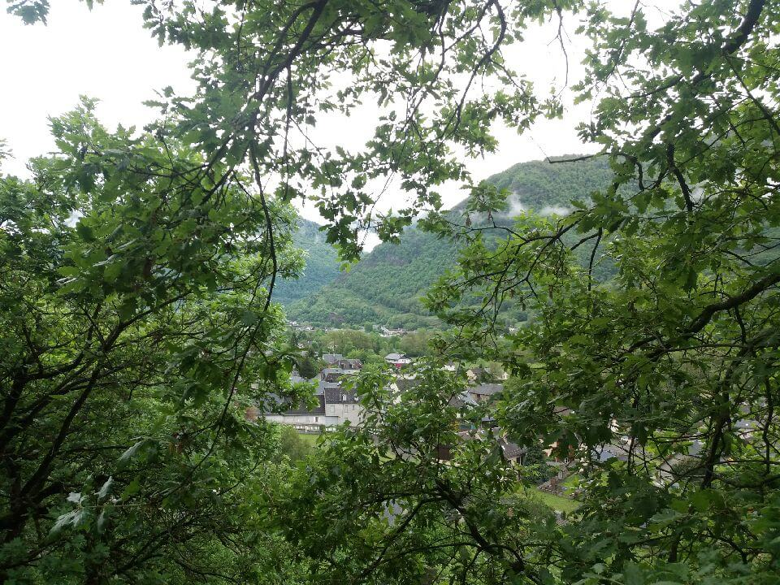
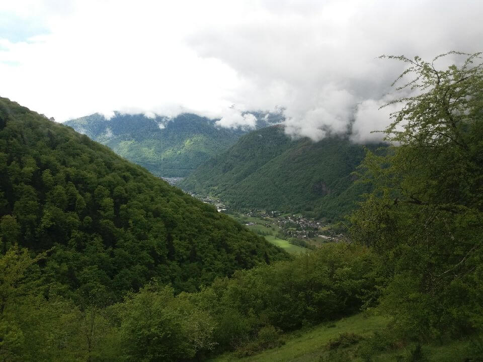

J'alterne entre pluie et éclaircie le long de la randonnée. Je commence l'ascension sous les arbres, c'est assez agréable.

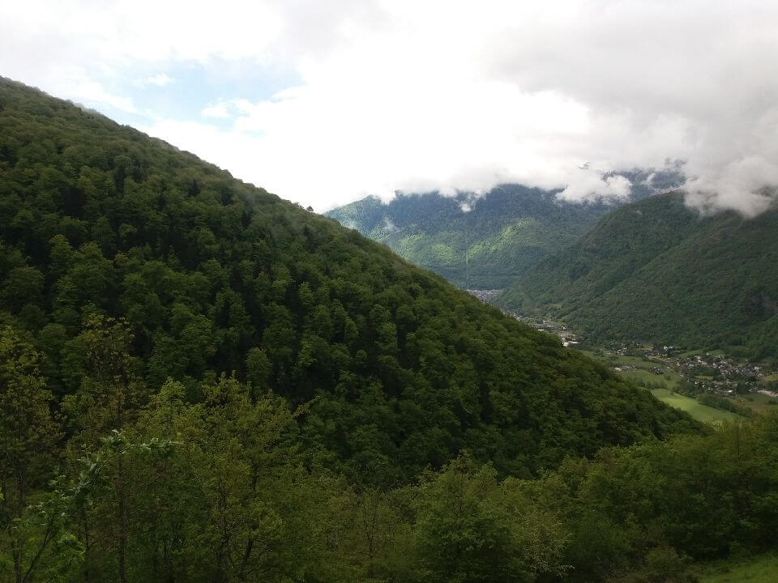
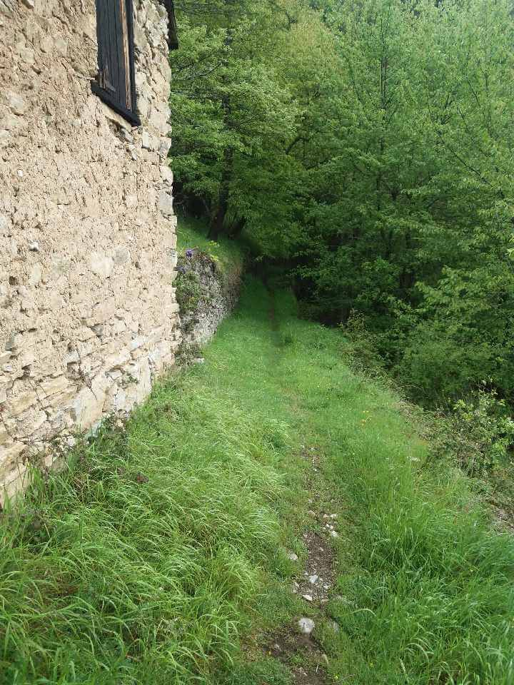

## Déjeuner

Je fais une halte à Artigues pour me sustenter à midi. Après un bon repas, je prends la direction de la cabane de Sauneres (_1660m d'altitude_). La pluie et la neige se mêle lors de cette montée.

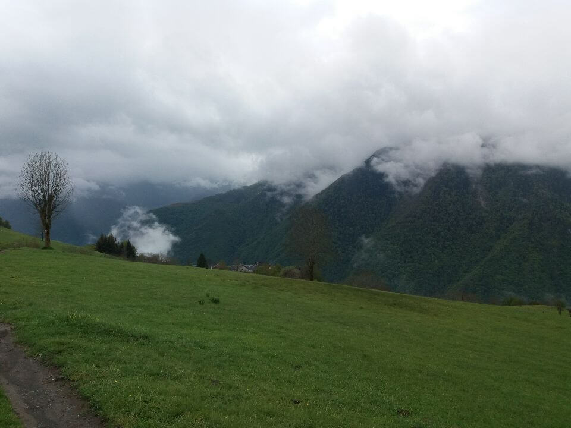
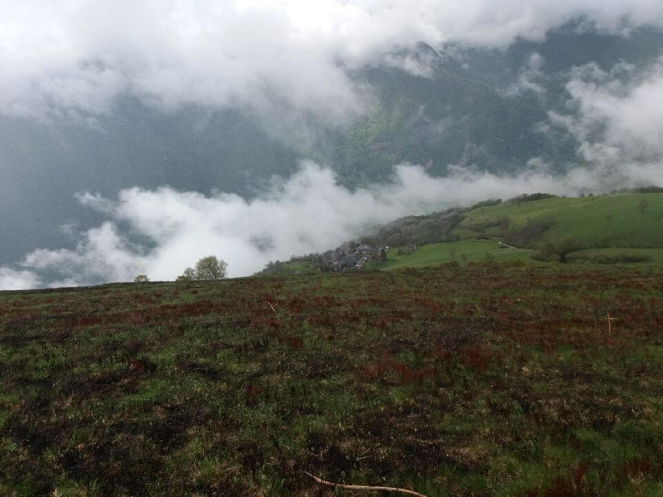
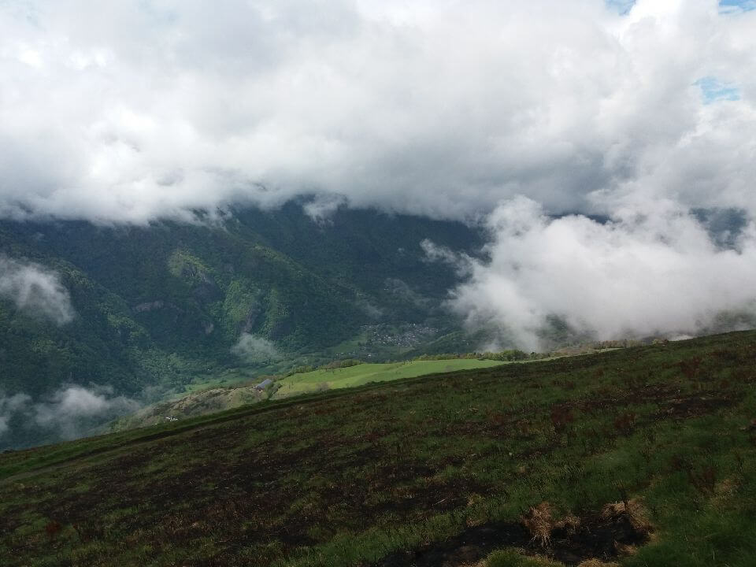

## Cabane de Sauneres

Une fois arrivé à la cabane, j'hésite à continuer à une autre cabane un peu plus haut à 1900m d'altitude. Sur le chemin, je croise un couple de randonneur (les seuls de la journée) qui m'ont dit qu'il faisait froid et que la cabane de Sauneres avait une cheminée. Je décide donc de rester là pour cette nuit !

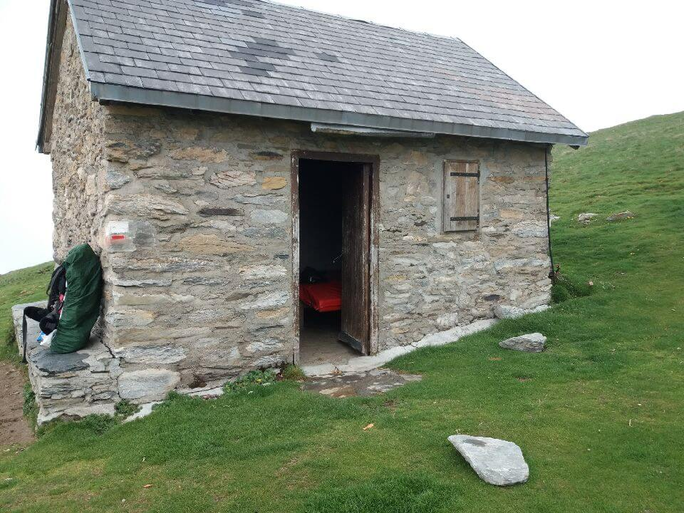
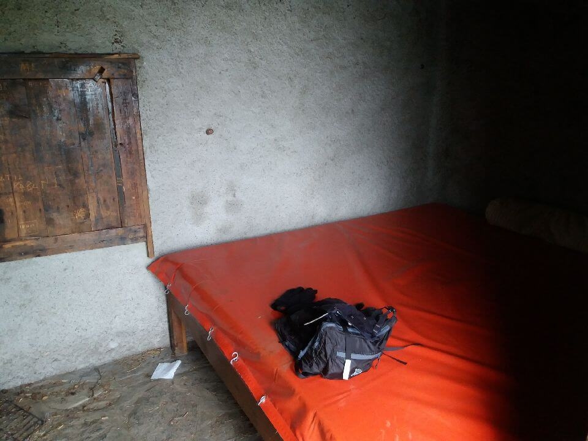

Ce n'est pas plus mal, la journée d'hier m'a fait mal aux jambes.

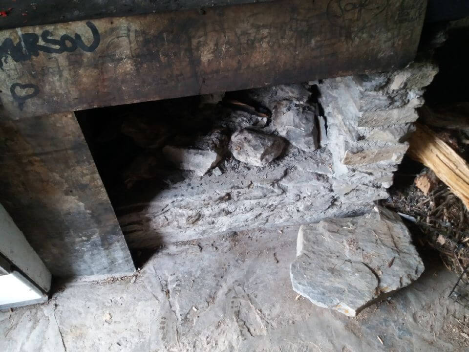
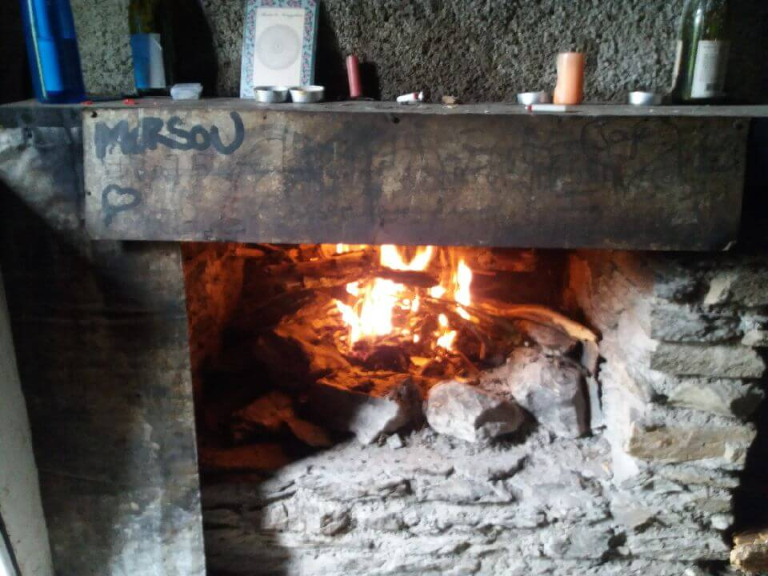

Pour demain, je monte à 2100m d'altitude et ensuite descente vers Fos à 600m d'altitude. Grosse descente de prévu.

## Point technique

### Informations sur l'itinéraire

-   **Distance** : 10.61 km
-   **Dénivelé positif** : 1055m
-   **Dénivelé négatif** : 22m
-   **Point haut** : 1667m
-   **Point bas** : 612m

### Parcours sur la carte

<iframe style="width: 100%; height: 50vh;" frameborder="0" scrolling="no" src="https://www.visorando.com/index.php?component=externe&task=showCarte&idRandonnee=2095092&satellite=1&carte=1&navigation=1&panZoom=1&mousePosition=1&scaleLine=1"></iframe>

### Courbe de dénivelé

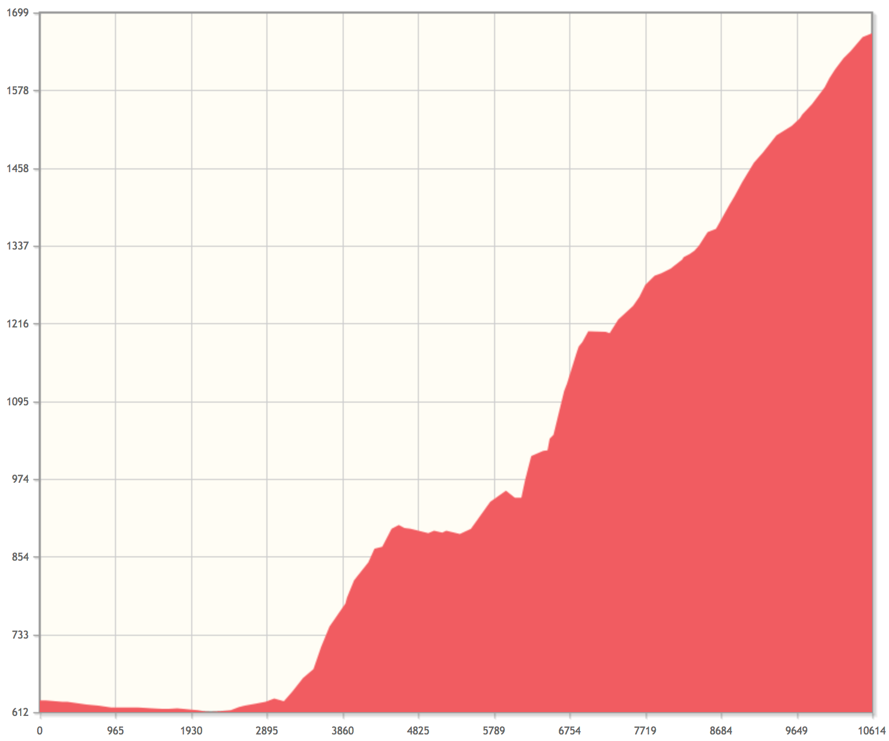
