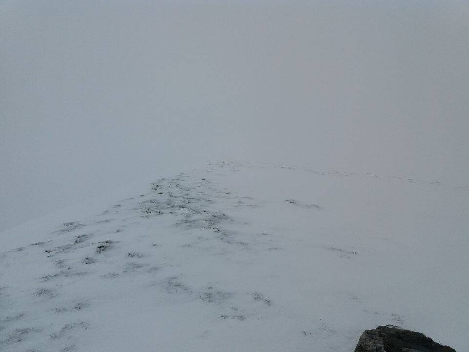

## Début d'une longue journée

Aujourd'hui, je m'apprête à faire une grosse journée ! J'ai passé une nuit super calme auprès de mon feu de cheminée.

Je quitte ma cabane aux alentours de 8h30 en direction du pic de Bécanere (_2192m d'altitude_). Le brouillard ne me quittera pas de la journée...

## De la neige au programme

À 1800m d'altitude, je marche dans la neige avec environ 20cm d'épaisseur. Je longe la frontière espagnole. J'ai des difficultés pour m'orienter, entre neige et brouillard c'est déjà compliqué, il faut en plus que les repères du GR10 se fassent rare.

J'arrive quand même à m'orienter grâce aux bornes de la frontière. Au moins, je sais que **je suis sur le bon itinéraire** ! Je fais tout à la boussole et à la carte IGN. J'ai été obligé de chausser mes crampons surtout pour la descente.

## Longue descente

De 2200m d'altitude, je descend jusqu'à 539m. Cette descente est usante mais le paysage qui s'offre à moi est magnifique. Un torrent et des sous bois m'accompagnent dans l'effort, c'est vraiment beau !

J'ai même la chance de croiser **des isarts**, **des biches** et même **un magnifique cerf** ! Malheureusement, le temps de sortir l'appareil photo et ils s'étaient volatilisés... Dommage, peut-être que j'arriverais à vous éblouir encore plus la prochaine fois !

## Pour la nuit

Ce soir, j'ai mal aux jambes et aux pieds. Mes genoux vont bien. Demain j'ai prévu une petite journée pour récupérer un peu. Je me suis arrêté à un refuge, j'ai donc on repas chaud et une douche au programme !

**Bonne nuit !**

## Point technique

### Informations sur l'itinéraire

-   **Distance** : 15.54 km
-   **Dénivelé positif** : 588m
-   **Dénivelé négatif** : 1717m
-   **Point haut** : 2188m
-   **Point bas** : 531m

### Parcours sur la carte

<iframe style="width: 100%; height: 50vh;" frameborder="0" scrolling="no" src="https://www.visorando.com/index.php?component=externe&task=showCarte&idRandonnee=2097449&satellite=1&carte=1&navigation=1&panZoom=1&mousePosition=1&scaleLine=1"></iframe>

### Courbe de dénivelé

