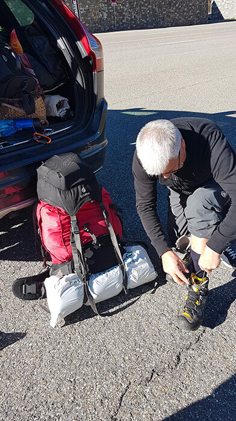
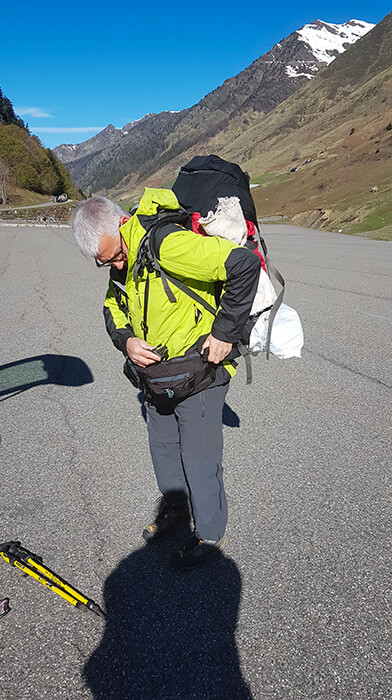
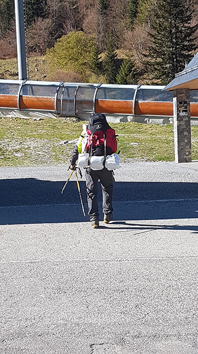
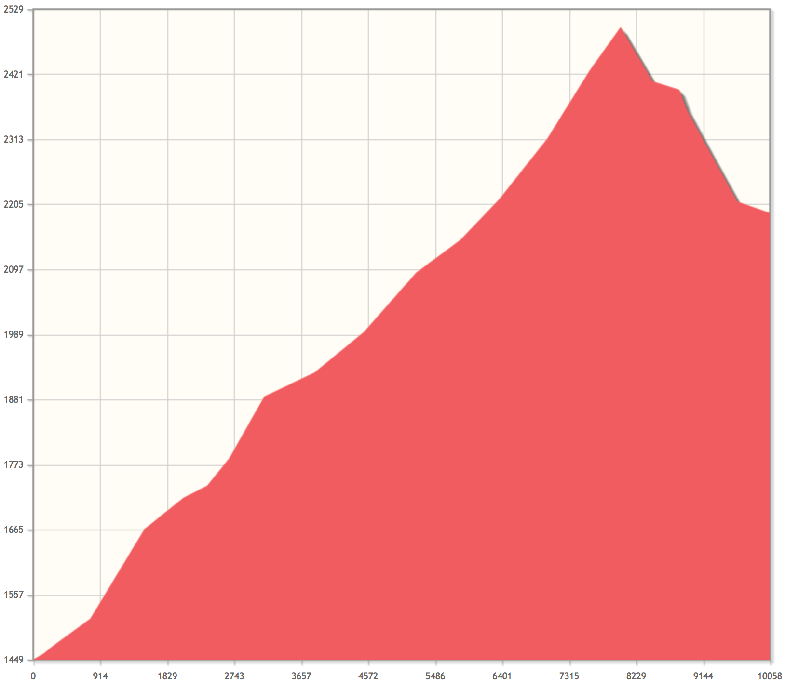

## Quelques réglages avant d'attaquer

Arrivé sur le parking du tournaboup au pied de la station de ski de barège aux alentours de 9h30.

Dernières vérifications avant le départ. Je me chausse de mes meilleures amis ou ennemis du mois à venir.

J'enfile mon coupe vent, puis me charge de mon précieux sac, 13 kilos environs. J'ajuste les sangles et me prépare à partir :

** Je suis prêt ! ** Prêt à attaquer la suite de mon parcours que j'avais laissé il y a quelques années déjà.

**_ GR10 me voilà !!! _**

## Première journée et déjà première neige

Première étape difficile, ascension de _ 1000m de dénivelé au programme_.

Je suis parti du ** parking du tournaboup** en direction du **col de Madaméte** (_ 2508m d'altitude _) pour ensuite me diriger vers le **lac d'Aubert** ou je décide de passer la nuit. Bien que le temps fût clément, la neige était au rendez-vous. Je n'ai pas trouvé d'endroit ou planter la tente pour la nuit, mais j'ai eu la chance de trouver une cabane dans laquelle m'abriter et faire la première nuit de mon aventure.

### Informations sur l'itinéraire

-   ** Distance ** : 10.06 km
-   ** Dénivelé positif ** : 1051m
-   ** Dénivelé négatif ** : 309m
-   ** Point haut ** : 2500m
-   ** Point bas ** : 1449m

### Le parcours sur la carte

<iframe style="width: 100%; height: 50vh;" frameborder="0" scrolling="no" src="https://www.visorando.com/index.php?component=externe&task=showCarte&idRandonnee=2078054&satellite=1&carte=1&navigation=1&panZoom=1&mousePosition=1&scaleLine=1"></iframe>

### La courbe de dénivelé

