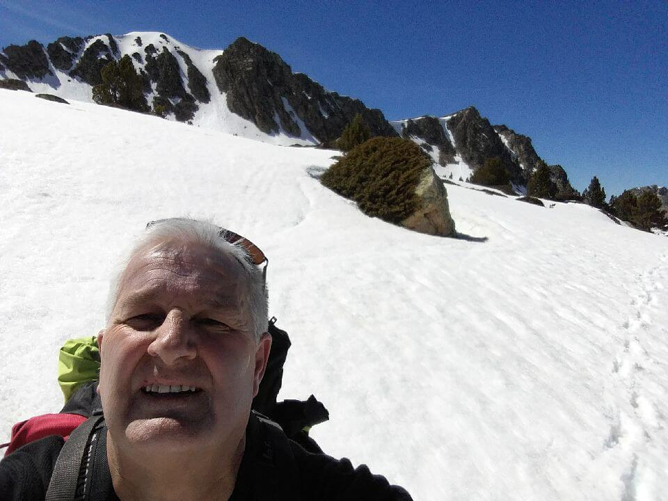
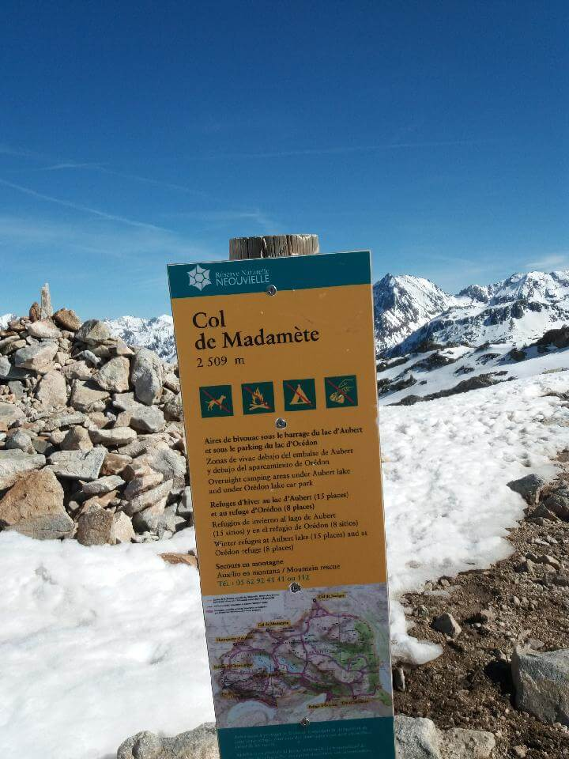
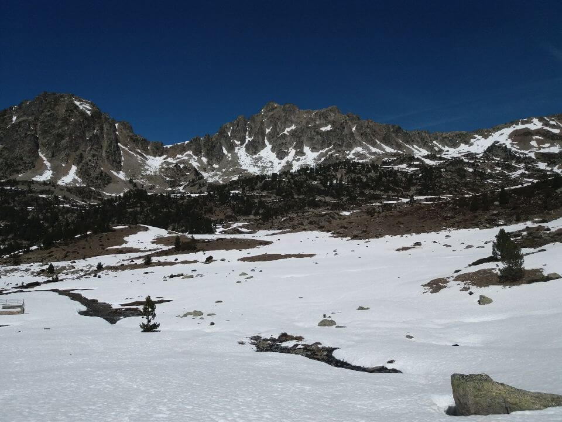
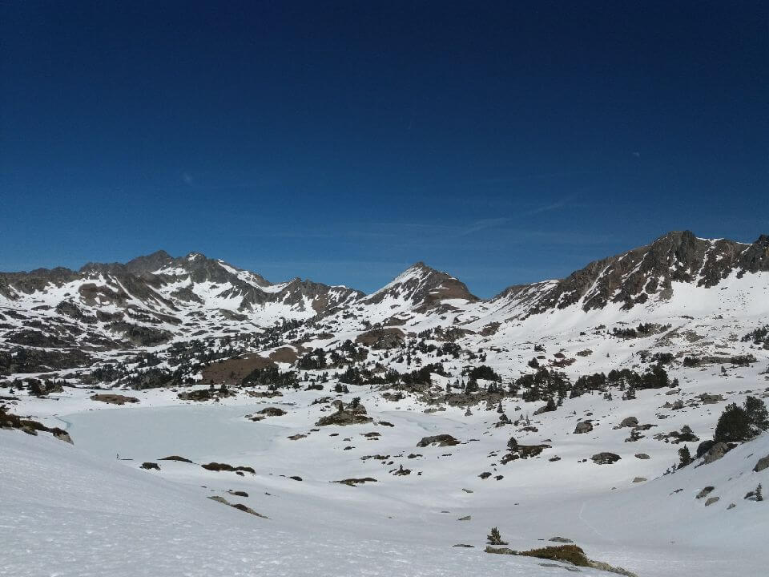
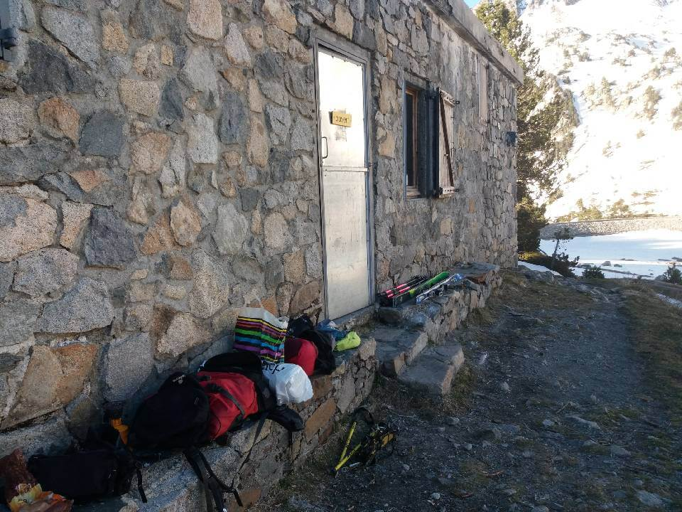

## Quelques réglages avant d'attaquer

Arrivé sur le parking du tournaboup au pied de la station de ski de barège aux alentours de 9h30.

Dernières vérifications avant le départ. Je me chausse de mes meilleures amies ou ennemies du mois à venir.

J'enfile mon coupe vent, puis me charge de mon précieux sac, 13 kilos environ. J'ajuste les sangles et me prépare à partir :

** Je suis prêt ! ** Prêt à attaquer la suite de mon parcours que j'avais laissé il y a quelques années déjà.

**_ GR10 me voilà !!! _**

## Première journée et déjà première neige

Première étape difficile, ascension de _ 1200m de dénivelé au programme_.

Je suis parti du ** parking du tournaboup** en direction du **col de Madaméte** (_ 2508m d'altitude _) pour ensuite me diriger vers le **lac d'Aubert**.

Bien que le temps fût clément, la neige était au rendez-vous. À 2000m d'altitude, je rencontre environ 1m50 de neige... Ma progression est alors difficile et usante. Je n'ai pas de repère et je suis obligé de me diriger à la boussole.

## Pour la nuit

Mon programme initial se retrouve donc perturbé. Je décide de m'arrêter au lac d'Aubert. Je n'ai pas trouvé d'endroit ou planter la tente pour dormir, mais j'ai eu la chance de trouver un refuge non gardé à côté du lac dans lequel m'abriter et faire la première nuit de mon aventure. **Bonne surprise**, la literie est de bonne qualité et je passe la nuit avec 3 randonneurs à ski. Je ferais donc une première nuit très réparatrice !

## Point Technique

### Informations sur l'itinéraire

-   ** Distance ** : 10.06 km
-   ** Dénivelé positif ** : 1051m
-   ** Dénivelé négatif ** : 309m
-   ** Point haut ** : 2500m
-   ** Point bas ** : 1449m

### Le parcours sur la carte

<iframe style="width: 100%; height: 50vh;" frameborder="0" scrolling="no" src="https://www.visorando.com/index.php?component=externe&task=showCarte&idRandonnee=2078054&satellite=1&carte=1&navigation=1&panZoom=1&mousePosition=1&scaleLine=1"></iframe>

### La courbe de dénivelé

