## C'est reparti

Après une bonne nuit de sommeil, j'ai encore une grosse journée devant moi. Je pars du refuge à 9h00.

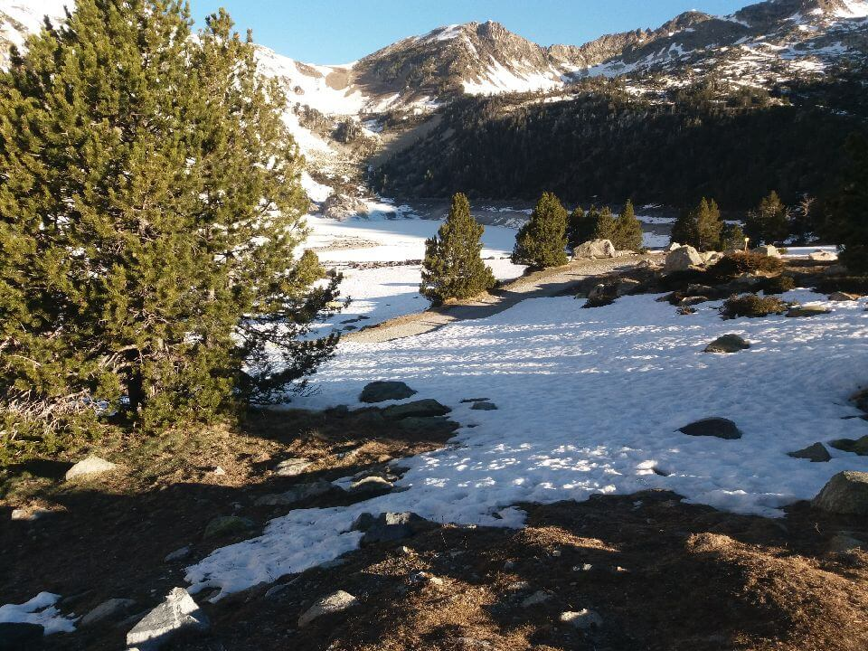
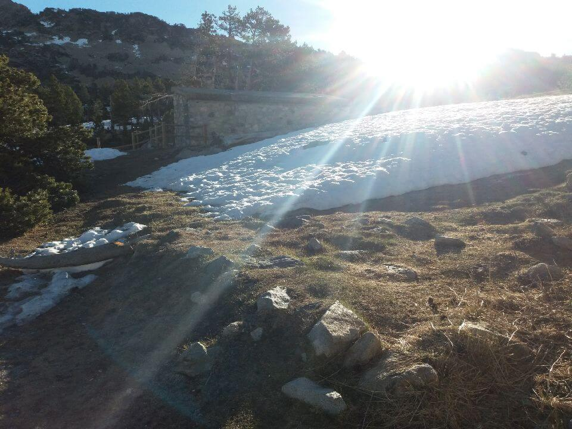

L'objectif d'aujourd'hui est de faire ** 21 km et deux cols**.

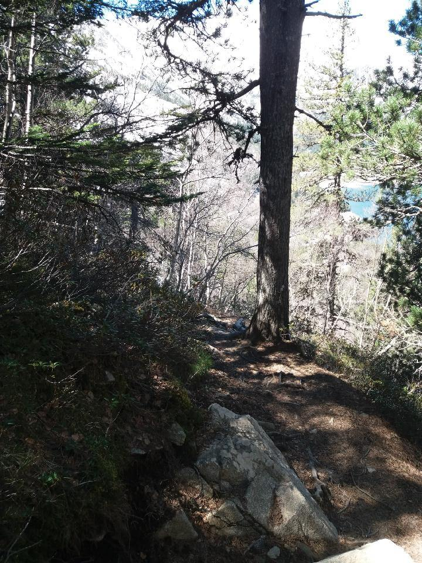

** 13h30 ** : J'arrive en haut du col d'estoudou (_2260m d'altitude_)

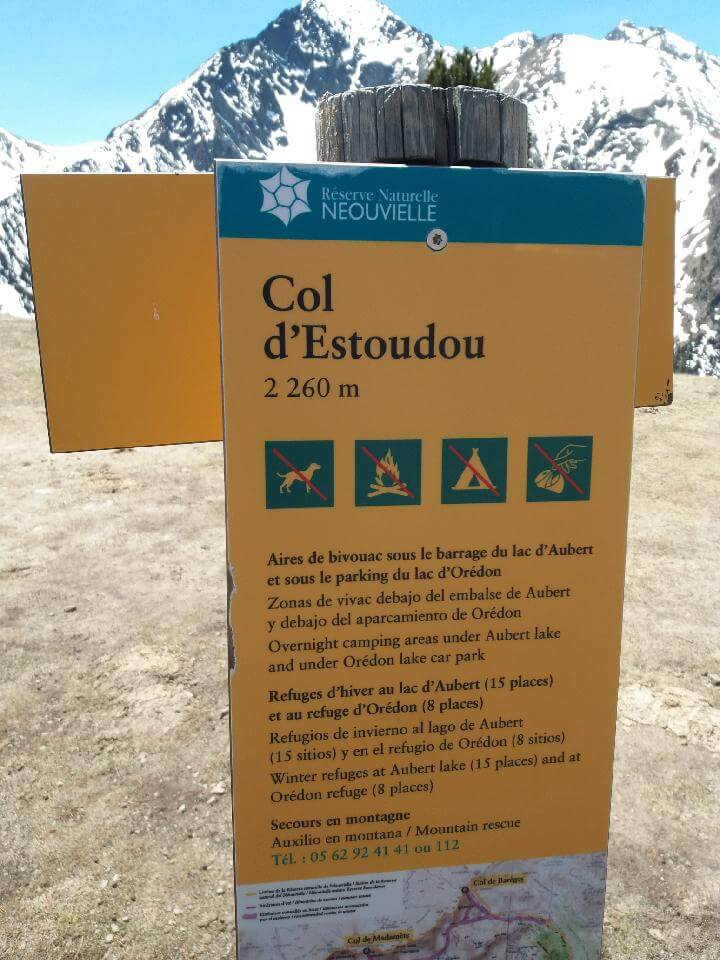
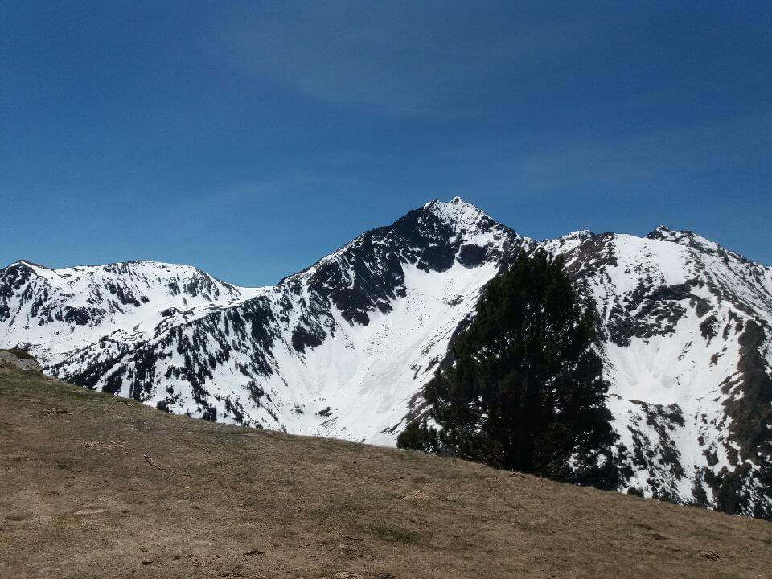
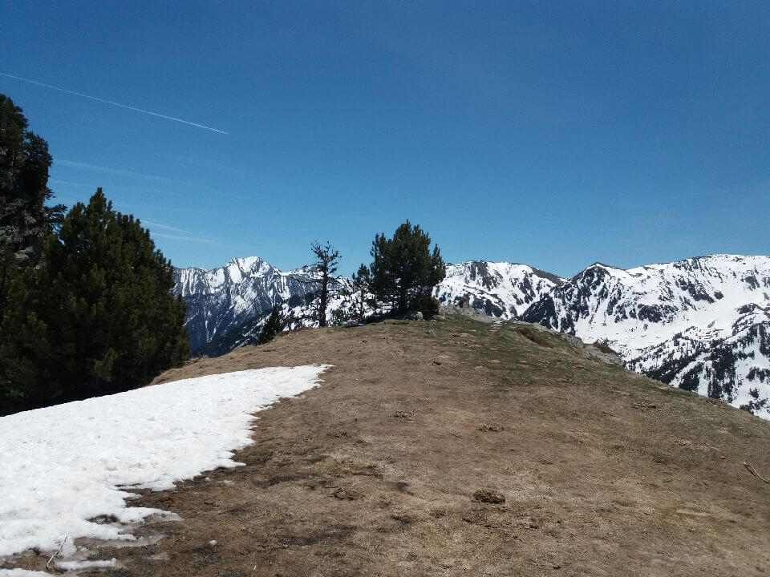
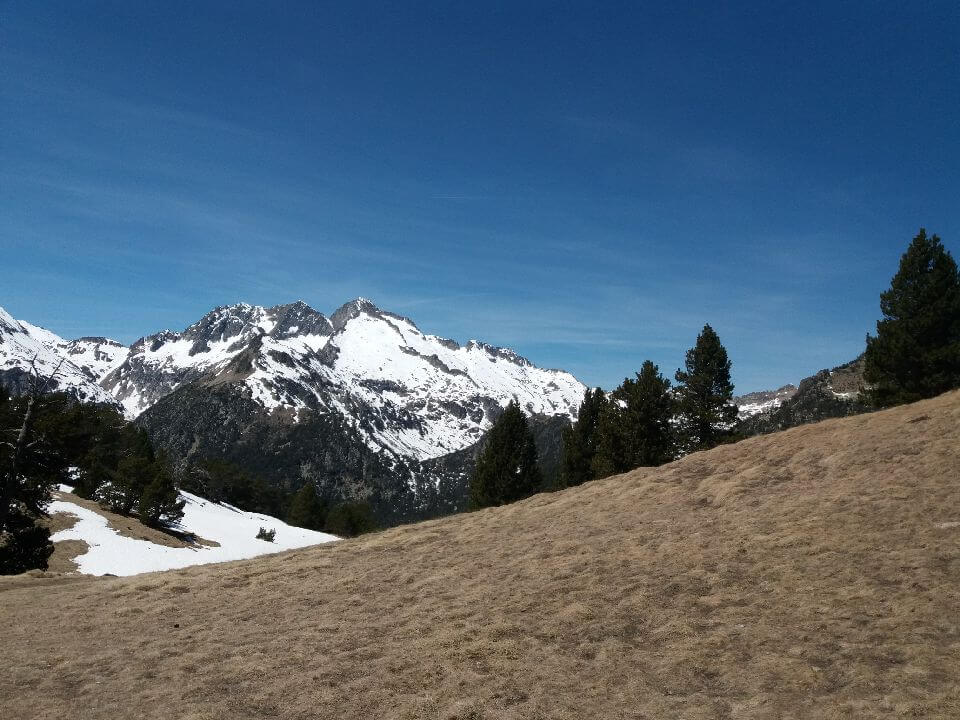

Cependant, comme hier, les cols sont enneigés et la neige est très mole si bien que je m'enfonce et ma progression s'en retrouve encore une fois ralentie.

Heureusement que j'ai mes crampons, je rencontre des dénivelés très pointus qui m'obligent à redoubler de vigilence pour ne pas glisser.

## Premier bivouac

** 16h30 ** : je choisi de m'arrêter pour aujourd'hui. Je me trouve au **lac de l'Oule** (_1820m d'altitude_).

Le site est magnifique ! J'aurais pu continuer, mais je prends la décision de me reposer. Je prépare mon campement pour passer la première nuit sous la tente.

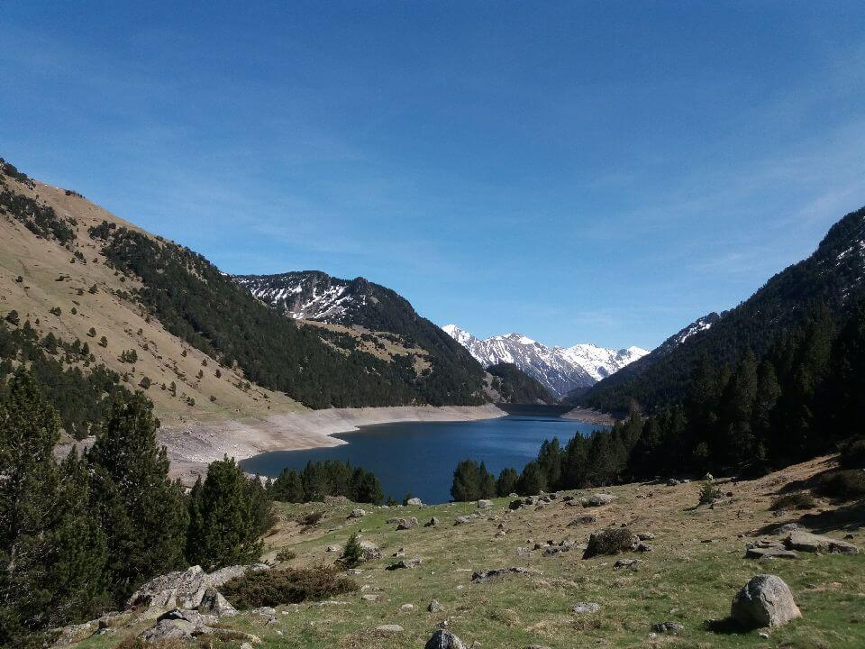
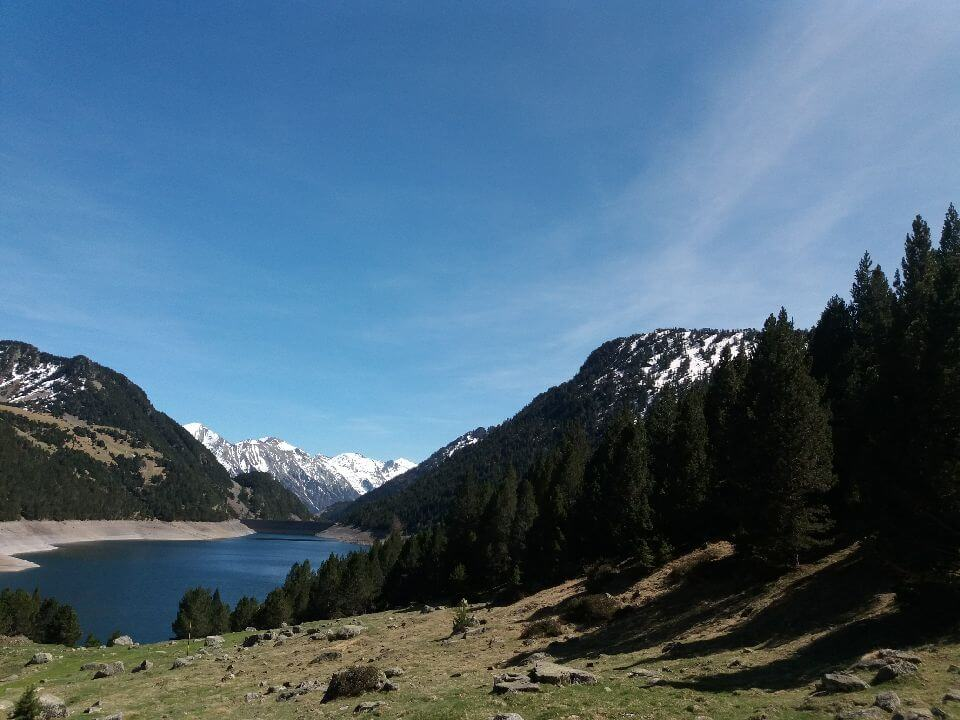
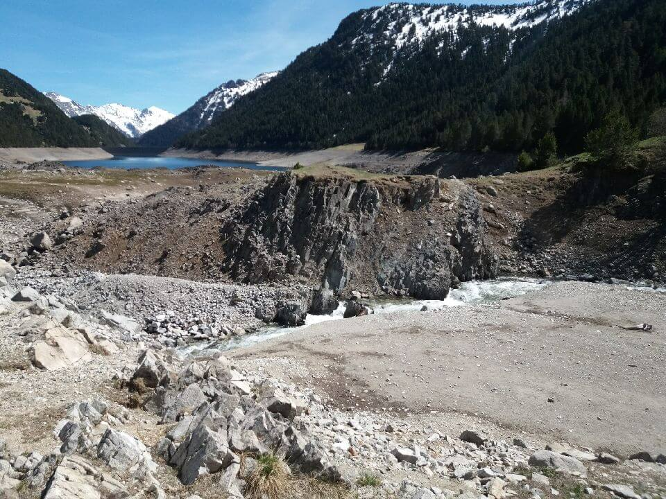

## Point technique

### Informations sur l'itinéraire

-   **Distance** : 6.65 km
-   **Dénivelé positif** : 113m
-   **Dénivelé négatif** : 490m
-   **Point haut** : 2251m
-   **Point bas** : 1819m

### Parcours sur la carte

<iframe style="width: 100%; height: 50vh;" frameborder="0" scrolling="no" src="https://www.visorando.com/index.php?component=externe&task=showCarte&idRandonnee=2079360&satellite=1&carte=1&navigation=1&panZoom=1&mousePosition=1&scaleLine=1"></iframe>

### Courbe de dénivelé

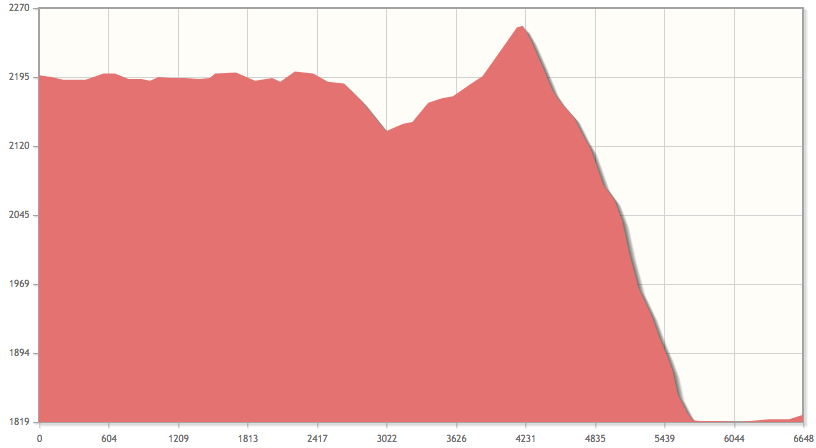
