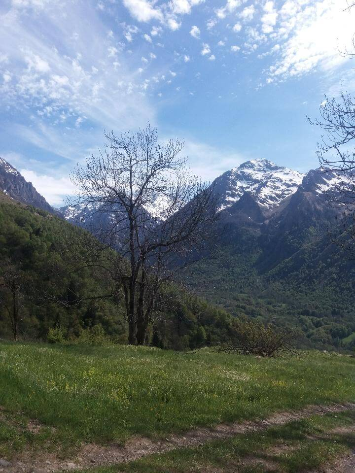

## Au petit matin

Ce matin, je me lève comme une fleur, j'ai dormi comme un bébé ! Je quitte le camping à 9h00 sous un temps magnifique.

Je commence à marcher et je n'ai plus aucune douleur. Et c'est reparti !

## Col suivant

Je m'apprête à faire l'ascension du col de Couret de latuhe (_1561m d'altitude_). Une ascention de 750m de dénivelé m'attend.

Lors de la montée, je perd mon téléphone... Je m'en aperçois juste avant d'arriver au sommet. Je décide de poser mon sac et de redescendre pour essayer de le trouver. Sans succès, j'ai beau chercher, rien ! MERDE !

Je fini par abandonner et remonter à mon sac. **Mon téléphone est là !!!** J'appelle Nath et elle me dit que quelqu'un l'a trouvé et remonté à mon sac car par chance une route suivait le sentier.

Incroyable !!! Il y a des gens honnêtes \o/

**Faith in humanity restored !!!**

Je termine l'ascension.

## Descente fatiguante puis remontée

Je continue mon chemin en direction de Loudenveille (_900m d'altitude_). La descente est longue et pénible...

Une fois en bas, je prend la direction de Germ (_1339m d'altitude_). Je reprend 439m de dénivelé positif sur 2km, une bonne difficulté mais j'arrive à Germ sans réel soucis.

Je m'arrêterais là pour ce soir. Je trouve une auberge dans laquelle m'abriter. Je suis le seul client, le propriétaire n'est sensé n'ouvrir que demain mais il accepte de me recevoir pour cette nuit.

Je décide de m'abriter car cette nuit une grosse tempête est prévue.

## Pour la suite

Demain, je ferai un point. Avec le gardien de l'auberge, nous avons contacté le refuge d'Astau qui est ma prochaine étape. Il est ouvert donc journée sous la pluie et je pense que samedi je serai bloqué au refuge pour la journée.

Je dois donc faire un choix. Affaire à suivre.

## Point technique

### Informations sur l'itinéraire

-   **Distance** : 11 km
-   **Dénivelé positif** : 1137m
-   **Dénivelé négatif** : 609m
-   **Point haut** : 1575m
-   **Point bas** : 796m

### Parcours sur la carte

<iframe style="width: 100%; height: 50vh;" frameborder="0" scrolling="no" src="https://www.visorando.com/index.php?component=externe&task=showCarte&idRandonnee=2084953&satellite=1&carte=1&navigation=1&panZoom=1&mousePosition=1&scaleLine=1"></iframe>

### Courbe de dénivelé

