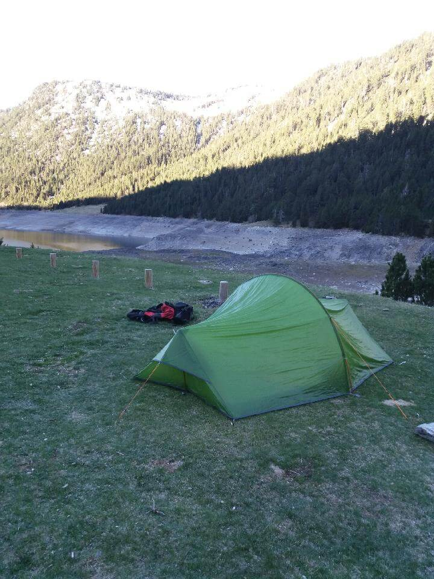

## Au petit matin

Je me réveille après une nuit au calme seul dans la montagne prêt d'un torrent qui m'a bercé tout du long. Hier soir j'avais une douleur au mollet gauche et ce matin **rien à signaler**, _je me sens mieux_.

Je plie la tente et me prépare pour partir à 9h00 !

## Un col pour la mise en jambe

Je longe le long du lac de l'Oule et me dirige vers le col de portet (_2215m d'altitude_). Départ un peu difficile et arrivée en haut également un peu difficile, j'ai juste eu besoin de chausser mes crampons (sans mes crampes ;) ) pour atteindre le haut du col.

## La descente

Après le col, je descend en direction de Veille-Aure (_900m d'altitude_).

**1400m de dénivelé négatif m'attendent**. Je parcours 7km sur le plateau puis termine avec 3km de descente très raide.

## Arrivé à Veille-Aure

Une fois arrivé à Veille-Aure, je trouve un camping ou passer la nuit. **Le GRAND LUXE ! Il y a des douches** ;)

Je trouve de quoi me ravitailler et j'ai le droit à un vrai bon repas _saucisses lentilles_. Ce soir, je me couche avec les jambes et les pieds douloureux.

## Point technique

### Informations sur l'itinéraire

-   **Distance** : 16.72 km
-   **Dénivelé positif** : 408m
-   **Dénivelé négatif** : 1439m
-   **Point haut** : 2215m
-   **Point bas** : 790m

### Parcours sur la carte

<iframe style="width: 100%; height: 50vh;" frameborder="0" scrolling="no" src="https://www.visorando.com/index.php?component=externe&task=showCarte&idRandonnee=2082309&satellite=1&carte=1&navigation=1&panZoom=1&mousePosition=1&scaleLine=1"></iframe>

### Courbe de dénivelé

